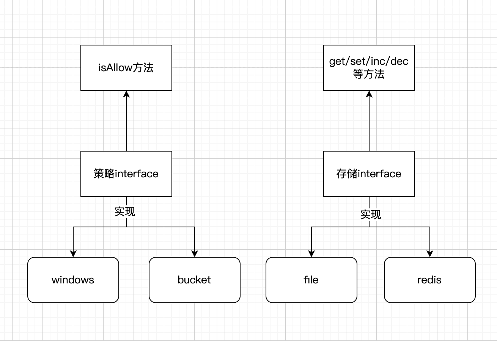

# requestlimit 请求控制器

## 1.支持方法

支持通过redis 和文件的存储，自己扩展可以通过实现接口 `RequestLimit\StorageInterface` 来增加新的支持类型。
支持窗口和令牌桶的策略，可以通过实现接口 `RequestLimit\StrategyInterface` 来扩展其他策略。



## 2. 使用方法

详情参考 [example 例子](https://github.com/wangschang/requestlimit/blob/master/example.php)

```php
require   'vendor/autoload.php';

use Predis\Client;
use RequestLimit\RequestLimit;
use RequestLimit\FileStorage;
use RequestLimit\RedisStorage;
use RequestLimit\RequestLimitException;
use RequestLimit\WindowsStrategy;
use RequestLimit\BucketStrategy;

$redis = new Client(['scheme' => 'tcp','host'   => '127.0.0.1','port'   => 6379]);
try{
       //$storgae = new FileStorage('/data/wwwlogs/requestlimit');//file storage
       $storgae = new RedisStorage($redis);//redis storage
        //$requestlimit = new RequestLimit(new WindowsStrategy(10,20),$storgae);
        $requestlimit = new RequestLimit(new BucketStrategy(1,0.1,5),$storgae);
        $uid = 1;
        if($requestlimit->isAllow($uid)){
                echo "allow";
        }else{
                echo "not allow";
 }catch(RequestLimitException $e){
       print_r($e->getRequestLimitMessage());
}catch(\Exception $e){
       echo $e->getMessage();
}
```

```

```
